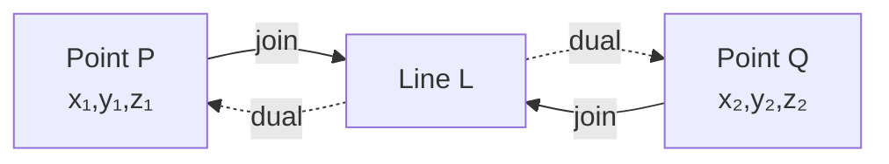
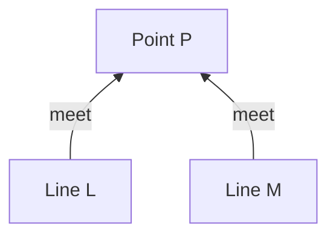
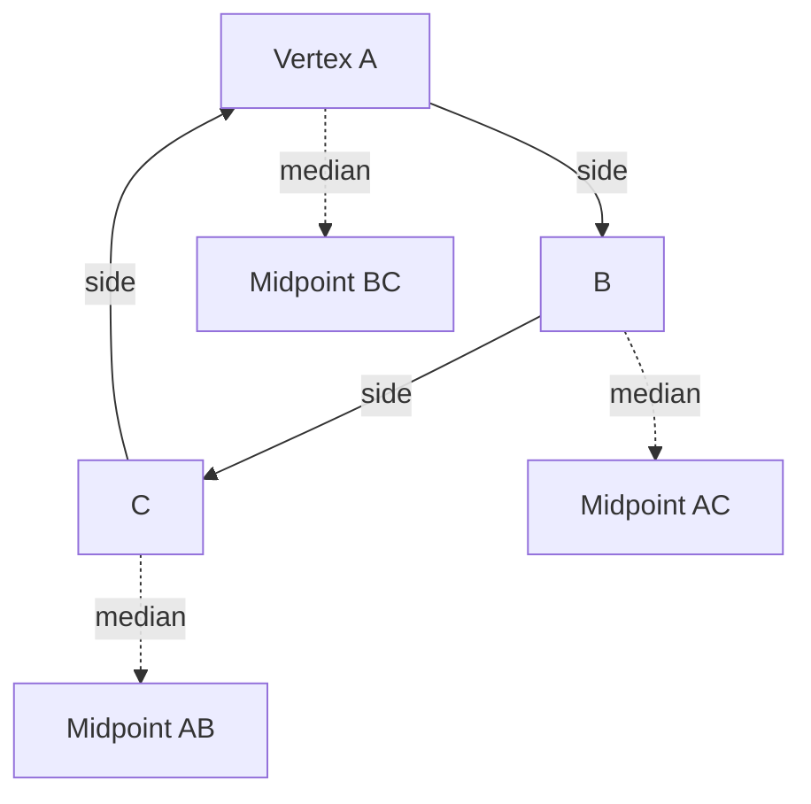
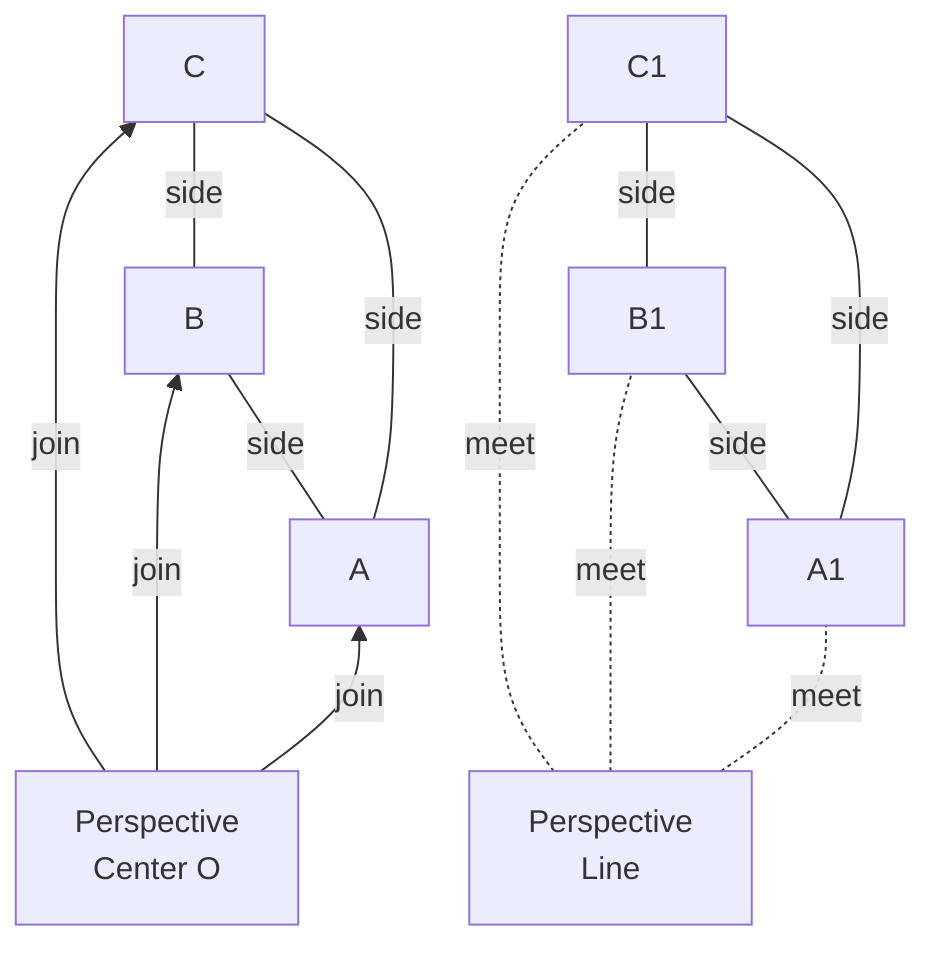
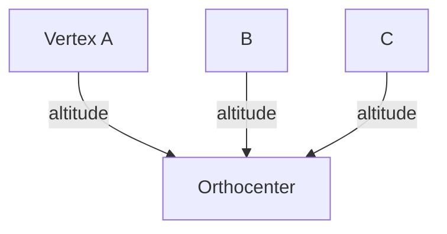
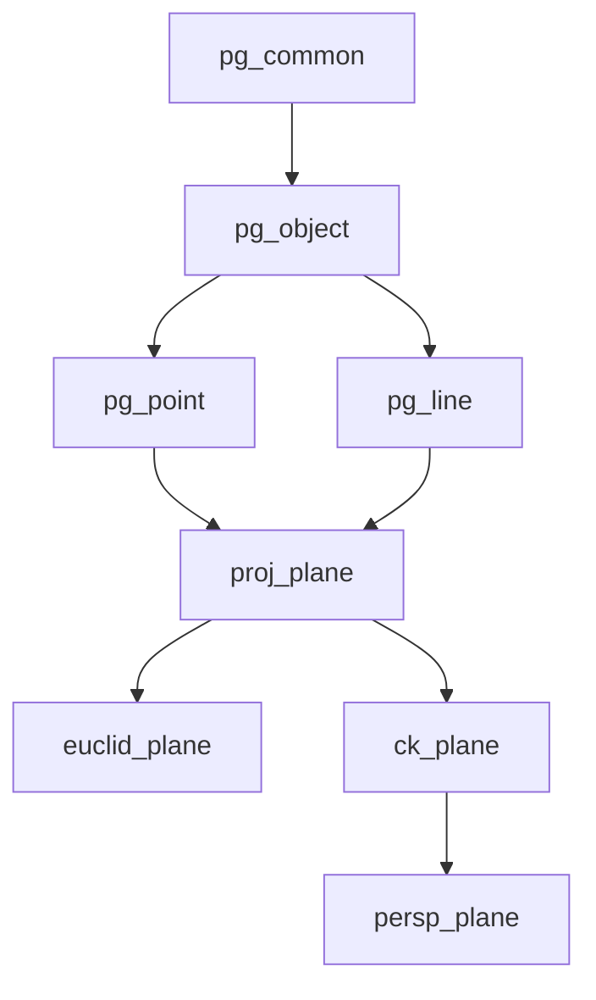

<!-- slide 1: Title Slide -->
# **Projective Geometry**
## A Modern C++ Implementation

🔯 *projgeom-cpp* — A header-only library for projective geometry with constexpr support

**Presented by:** Wai-Shing Luk  
**Date:** April 2026

---

<!-- slide 2: What is Projective Geometry? -->
# 🚀 What is Projective Geometry?

> "The study of properties that are invariant under projection"

- **Classical Geometry**: Euclidean — parallel lines never meet
- **Projective Geometry**: All lines meet at a point at infinity! 📍

### Why Projective Geometry?

| Feature | Euclidean | Projective |
|---------|-----------|-----------|
| Parallel lines | Never intersect | ✓ Meet at ∞ |
| Conics | Separate conic sections | Unified treatment |
| Perspective | Requires limits | Natural framework |

---

<!-- slide 3: The Projective Plane -->
# 📐 The Projective Plane

Points as **homogeneous coordinates**:

$$
P = [x : y : z] \quad \text{where } (x, y, z) \neq (0, 0, 0)
$$

- Represented in $\mathbb{P}^2$ — 2D projective space
- **Lines** are also points in the dual space $\mathbb{P}^{2*}$

### Duality Principle 🔄

> "Points and lines are dual objects"

```cpp
// In projgeom-cpp:
template <Ring _K> struct pg_point : pg_object<_K, pg_line<_K>> { ... };
template <Ring _K> struct pg_line : pg_object<_K, pg_point<_K>> { ... };
```

---

<!-- slide 4: Fundamenta Axioms -->
# 📜 Fundamental Axioms

From the library header `pg_object.hpp`:

1. **Incidence**: For any two distinct points, there exists a unique line through them
2. **Duality**: For any two distinct lines, there exists a unique point at their intersection
3. **Completeness**: There exist four points, no three of which are collinear

### Key Property: **Check Axiom**

```cpp
template <Ring _K>
constexpr auto check_axiom(
    const pg_point<_K> &pt_p,
    const pg_point<_K> &pt_q,
    const pg_line<_K> &ln_m
) -> bool {
    return incident(pt_p, pt_q * pt_m) && incident(pt_q, pt_p * pt_m);
}
```

---

<!-- slide 5: Core Operations - Join -->
# 🔗 Core Operation: Join

**Join** connects two points to form the line passing through them

### Mathematical Definition:

$$
\text{join}(P, Q) = P \times Q \quad \text{(cross product)}
$$

### Mermaid Diagram:



### Code Implementation:

```cpp
template <Ring _K>
constexpr auto join(const pg_point<_K> &pt_p, const pg_point<_K> &pt_q) -> pg_line<_K> {
    return pt_p * pt_q;  // Cross product operation
}
```

---

<!-- slide 6: Core Operations - Meet -->
# ✂️ Core Operation: Meet

**Meet** finds the intersection point of two lines

### Mathematical Definition:

$$
\text{meet}(l, m) = l \times m \quad \text{(cross product)}
$$

### Duality in Action:

| Operation | Input | Output | Symbol |
|-----------|-------|--------|--------|
| **Join** | Point × Point | Line | $P \cdot Q$ |
| **Meet** | Line × Line | Point | $l \cdot m$ |

### Code Implementation:

```cpp
template <Ring _K>
constexpr auto meet(const pg_line<_K> &ln_l, const pg_line<_K> &ln_m) -> pg_point<_K> {
    return ln_l * ln_m;  // Cross product operation
}
```

### Visual:



---

<!-- slide 7: Incidence Relation -->
# 🎯 Incidence Relation

A point $P$ lies on line $L$ if their dot product equals zero:

$$
P \cdot L = 0
$$

### Implementation:

```cpp
template <typename Point, typename Line>
    requires ProjectivePlane<Point, Line>
constexpr auto incident(const Point &pt_p, const Line &ln_l) -> bool {
    return pt_p.dot(ln_l) == Value_type<Point>(0);
}
```

### Test Case:

```cpp
TEST_CASE("Point-Line Incidence") {
    auto pt_p = pg_point{1, 2, 3};
    auto pt_q = pg_point{4, 5, 6};
    auto l = join(pt_p, pt_q);
    
    CHECK_EQ(fun::incident(pt_p, l), true);
    CHECK_EQ(fun::incident(pt_q, l), true);
}
```

---

<!-- slide 8: Cross Ratio - The Fundamental Invariant -->
# 📊 Cross Ratio — The Projective Invariant

The **cross ratio** $(A, B; C, D)$ is preserved under all projective transformations!

### Definition:

$$
(A, B; C, D) = \frac{\overline{AC}}{\overline{BC}} \div \frac{\overline{AD}}{\overline{BD}}
$$

In homogeneous coordinates:

$$
(A, B; C, D) = \frac{\det(A,C)\det(B,D)}{\det(B,C)\det(A,D)}
$$

### Properties:

- **Invariant** under all projective transformations
- **Complete invariant** for 4 collinear points
- Value = $-1$ for **harmonic range** 🎸

### Projective Distance Measure:

Using $\omega$ function (from `persp_plane.hpp`):

$$
\omega(P) = (P \cdot L_\infty)^2
$$

---

<!-- slide 9: Triangle Operations -->
# 🔺 Triangle Operations

### Dual Triangle

```cpp
template <ProjectivePlanePrim2 Point>
constexpr auto tri_dual(const Triple<Point> &triangle) {
    const auto &[a1, a2, a3] = triangle;
    return std::array{a2 * a3, a1 * a3, a1 * a2};
}
```

### Triangle Midpoints (Euclidean)

```cpp
template <ProjectivePlaneCoord2 Point>
constexpr auto tri_midpoint(const Triple<Point> &triangle) -> Triple<Point> {
    const auto &[a1, a2, a3] = triangle;
    return {midpoint(a1, a2), midpoint(a2, a3), midpoint(a1, a3)};
}
```

### Visual Structure:



---

<!-- slide 10: Harmoniconjugates -->
# 🎵 Harmonic Conjugate

Given three collinear points $A, B, C$, find $D$ such that $(A,B;C,D) = -1$

### Implementation (from `proj_plane.hpp`):

```cpp
template <ProjectivePlane2 Point>
constexpr auto harm_conj(const Point &A, const Point &B, const Point &C) -> Point {
    assert(incident(A * B, C));
    const auto lC = C * (A * B).aux();
    return parametrize(B.dot(lC), A, A.dot(lC), B);
}
```

### Geometric Construction:


---

<!-- slide 11: Desargues Theorem -->
# 🏛️ Desargues' Theorem

> "Two triangles are perspective from a point **iff** they are perspective from a line"

### Visual Representation:



### Implementation:

```cpp
template <ProjectivePlanePrim2 Point>
void check_desargue(const Triple<Point> &tri1, const Triple<Point> &tri2) {
    const auto trid1 = tri_dual(tri1);
    const auto trid2 = tri_dual(tri2);
    const auto bool1 = persp(tri1, tri2);
    const auto bool2 = persp(trid1, trid2);
    assert((bool1 && bool2) || (!bool1 && !bool2));
}
```

---

<!-- slide 12: Pappus Theorem -->
# 📜 Pappus' Theorem

> "For two collinear triples, the three intersection points are collinear"

### Statement:

Given collinear points $A, B, C$ and $D, E, F$:
- Join $A$ to $E$, $B$ to $D$, intersect at $G$
- Join $A$ to $F$, $C$ to $D$, intersect at $H$  
- Join $B$ to $F$, $C$ to $E$, intersect at $I$
- Then $G, H, I$ are collinear 📏

### Implementation:

```cpp
template <ProjectivePlanePrim2 Point>
void check_pappus(const Triple<Point> &coline1, const Triple<Point> &coline2) {
    const auto &[A, B, C] = coline1;
    const auto &[D, E, F] = coline2;

    const auto G = (A * E) * (B * D);
    const auto H = (A * F) * (C * D);
    const auto I = (B * F) * (C * E);
    assert(coincident(G, H, I));  // Verify collinearity
}
```

---

<!-- slide 13: Involution -->
# 🔄 Involution

An **involution** is a transformation that is its own inverse: $T^2 = I$

### Types:

1. **Reflection** across a line
2. **Projective homology** (perspectivity)
3. **Rotation** in hyperbolic geometry

### Implementation:

```cpp
template <typename Point, typename Line>
    requires ProjectivePlane<Point, Line>
class Involution {
    Line _m;
    Point _o;
    K _c;

  public:
    constexpr auto operator()(const Point &pt_p) const -> Point {
        return parametrize(this->_c, pt_p, K(-2 * pt_p.dot(this->_m)), this->_o);
    }
};
```

### Visual:


---

<!-- slide 14: Homogeneous Coordinates -->
# 📊 Homogeneous Coordinates

Every point $(x, y)$ in $\mathbb{R}^2$ maps to $[x : y : 1]$ in $\mathbb{P}^2$

### Mapping Table:

| Affine $(x, y)$ | Homogeneous $[x : y : z]$ |
|----------------|--------------------------|
| $(2, 3)$ | $[2 : 3 : 1]$ |
| $(1, 1)$ | $[1 : 1 : 1]$ |
| $(\infty, y)$ | $[1 : 0 : 0]$ (point at infinity) |

### The Line at Infinity:

$$
L_\infty = [0 : 0 : 1]
$$

All "parallel" lines meet at points on $L_\infty$!

### In projgeom-cpp:

```cpp
// Point construction
pg_point<int> pt{1, 2, 3};  // Represents (1/3, 2/3)

// Line from two points
auto line = join(pt1, pt2);  // Cross product
```

---

<!-- slide 15: Cayley-Klein Geometry -->
# 🔯 Cayley-Klen Geometry

A **Cayley-Klein plane** generalizes multiple geometries:

### Types of Geometry:

| Type | Inner Metric | Distance Formula |
|------|-------------|-----------------|
| **Elliptic** | $x \cdot x > 0$ | $\cos d = -\frac{P \cdot Q}{\sqrt{\omega(P)\omega(Q)}}$ |
| **Euclidean** | $P \cdot Q = 0$ | $d = \sqrt{\frac{P \cdot Q}{\omega(P)}}$ |
| **Hyperbolic** | $x \cdot x < 0$ | $\cosh d = \frac{P \cdot Q}{\sqrt{\omega(P)\omega(Q)}}$ |

### Implementation (`ck_plane.hpp`):

```cpp
template <typename Point, typename Line>
class ck {
    // Cayley-Klein geometry with configurable metric
};
```

---

<!-- slide 16: Perspective-Euclidean Plane -->
# 📐 Perspective-Euclidean Plane

Combines projective coordinates with Euclidean metric:

```cpp
template <typename Point, typename Line>
    requires ProjectivePlanePrim<Point, Line>
class persp_euclid_plane : public ck<Point, Line, persp_euclid_plane> {
    Point _I_re;   // Real unit circle point
    Point _I_im;   // Imaginary unit circle point
    Line _l_inf;   // Line at infinity
};
```

### Key Functions:

- `l_inf()` — Get the line at infinity
- `perp(v)` — Pole of a line (perpendicular)
- `is_parallel(l, m)` — Check parallelism
- `omega(P)` — Distance to $L_\infty$

### Cross-ratio Measure:

```cpp
template <ProjectivePlane2 _Point>
constexpr auto measure(const _Point &a1, const _Point &a2) const {
    return omega(a1 * a2) / (omega(a1) * omega(a2));
}
```

---

<!-- slide 17: Euclidean Plane Properties -->
# 📏 Euclidean Plane (from euclid_plane.hpp)

### Perpendicular Lines:

```cpp
constexpr auto is_perpendicular(const Line &ln_l, const Line &ln_m) -> bool {
    return dot1(line_l, line_m) == 0;
}
```

### Parallel Lines:

```cpp
constexpr auto is_parallel(const Line &ln_l, const Line &ln_m) -> bool {
    return cross2(line_l, line_m) == 0;
}
```

### Orthocenter:

```cpp
constexpr auto orthocenter(const Triple<Point> &triangle) -> Point {
    const auto &[a1, a2, a3] = triangle;
    const auto t1 = altitude(a1, a2 * a3);
    const auto t2 = altitude(a2, a1 * a3);
    return t1 * t2;
}
```

### Visual:



---

<!-- slide 18: Cyclic Quadrilaterals & Ptolemy -->
# ⭕ Cyclic Quadrilaterals & Ptolemy

**Ptolemy's Theorem**: For a cyclic quadrilateral:

$$
AC \cdot BD = AB \cdot CD + AD \cdot BC
$$

### Implementation:

```cpp
template <typename T> constexpr auto Ptolemy(const T &quad) -> bool {
    const auto &[Q12, Q23, Q34, Q14, Q13, Q24] = quad;
    return archimedes(Q12 * Q34, Q23 * Q14, Q13 * Q24) == _K(0);
}

template <OrderedRing _Q>
constexpr auto archimedes(const _Q &a, const _Q &b, const _Q &c) {
    return 4 * a * b - sq(a + b - c);
}
```

### The CQQ (Cyclic Quadrilateral Quadrea):

```cpp
template <typename _Q>
constexpr auto cqq(const _Q &a, const _Q &b, const _Q &c, const _Q &d) 
    -> std::array<_Q, 2> {
    const auto t1 = 4 * a * b;
    const auto t2 = 4 * c * d;
    auto line_m = (t1 + t2) - sq(a + b - c - d);
    auto point_p = line_m * line_m - 4 * t1 * t2;
    return {line_m, point_p};
}
```

---

<!-- slide 19: C++20 Concepts -->
# 💻 C++20 Concepts in projgeom-cpp

The library uses modern C++20 concepts for type safety:

### Key Concepts:

```cpp
// From common_concepts.h
template <typename T>
concept Ring = /* ... */;

template <typename T>
concept OrderedRing = Ring<T> && /* ... */;

template <typename Point, typename Line>
concept ProjectivePlane = /* ... */;

template <typename Point>
concept ProjectivePlanePrim2 = /* ... */;
```

### Usage:

```cpp
template <typename Point, typename Line>
    requires ProjectivePlane<Point, Line>
constexpr auto incident(const Point &pt_p, const Line &ln_l) -> bool {
    return pt_p.dot(ln_l) == Value_type<Point>(0);
}
```

### Benefits:

- ✅ Compile-time validation
- ✅ Clear error messages
- ✅ Documentation in code

---

<!-- slide 20: constexpr Support -->
# ⚡ constexpr Everything

All computations are `constexpr` for compile-time evaluation:

```cpp
// Compile-time point creation
constexpr auto pt_p = pg_point{1, 2, 3};
constexpr auto pt_q = pg_point{4, 5, 6};

// Join at compile-time
constexpr auto line = join(pt_p, pt_q);

// All operations are constexpr!
template <Ring _K>
constexpr auto cross(const Point &v, const Point &w) -> std::array<Value_type<Point>, 3> {
    return {cross0(v, w), -cross1(v, w), cross2(v, w)};
}
```

### Verify with static_assert:

```cpp
static_assert(incident(pt_p, line) == true);
static_assert(incident(pt_q, line) == true);
```

### No runtime overhead! 🚀

---

<!-- slide 21: Branchless Computation -->
# 🌿 Branchless Computation

Optimized for performance with no branches:

```cpp
template <Ring _K> auto cross0(const std::array<_K, 3> &v, const std::array<_K, 3> &w) -> _K {
    return v[1] * w[2] - w[1] * v[2];
}

template <Ring _K> auto cross(const Point &v, const Point &w) -> std::array<Value_type<Point>, 3> {
    return {cross0(v, w), -cross1(v, w), cross2(v, w)};
}
```

### Cross Product Components:

| Component | Formula |
|----------|--------|
| $c_0$ | $v_1 w_2 - w_1 v_2$ |
| $c_1$ | $v_0 w_2 - w_0 v_2$ |
| $c_2$ | $v_0 w_1 - w_0 v_1$ |

### Benefits:

- SIMD-friendly 📦
- Predictable timing ⏱️
- No branch misprediction penalties

---

<!-- slide 22: Testing Framework -->
# 🧪 Testing Framework

Uses **doctest** for unit testing and **RapidCheck** for property-based testing:

### Unit Test Example:

```cpp
TEST_CASE("Perspective") {
    auto pt_p = pg_point{3, 4, 5};
    auto pt_q = pg_point{5, 4, 3};
    auto ln_m = pg_line{2, 3, 4};
    
    CHECK(fun::check_axiom(pt_p, pt_q, ln_m));
}
```

### Property-Based Test:

```cpp
#ifdef RAPIDCHECK_H
TEST_CASE("Cross product is anti-symmetric") {
    auto [v, w] = gen().template produce<arenas::two>();
    
    RC_PRE(!coincident(v * w));
    RC_ASSERT(cross(v, w) == -cross(w, v));
}
#endif
```

### Run Tests:

```bash
cd build/test && ctest -V
```

---

<!-- slide 23: Build System -->
# 🏗️ Build System

Modern CMake with CPM.cmake:

```cmake
project(ProjGeom VERSION 1.0.5 LANGUAGES CXX)

# Header-only library
add_library(${PROJECT_NAME} INTERFACE)

# Dependencies via CPM
CPMAddPackage("gh:TheLartians/PackageProject.cmake@1.8.0")
```

### Configuration Options:

| Option | Description |
|--------|------------|
| `-DENABLE_TEST_COVERAGE=1` | Code coverage |
| `-DUSE_SANITIZER=Address` | Address sanitizer |
| `-DUSE_STATIC_ANALYZER=clang-tidy` | Static analysis |

### Build & Test:

```bash
cmake -S. -B build
cmake --build build
cd build/test && ctest -V
```

---

<!-- slide 24: Code Coverage -->
# 📊 Code Coverage

Comprehensive test coverage:

```bash
cmake -S. -B build -DENABLE_TEST_COVERAGE=1
cmake --build build
cd build/test && ctest
```

### Coverage Report:

```
Filename                        |  Regions |  Missed Regions | Cover | Functions  | Missed Functions | Executed |      Coverage |
----------------------------|----------|------------------|-------|-----------|------------------|--------|------------------|
pg_point.hpp                |        8|               0| 100.00%|          6|               0| 100.00%|          100.00%|
pg_line.hpp                |        7|               0| 100.00%|          5|               0| 100.00%|          100.00%|
proj_plane.hpp             |       15|               1|  93.33%|         12|               1|  91.67%|           91.67%|
euclid_plane.hpp          |        9|               0| 100.00%|          8|               0| 100.00%|          100.00%|

----------------------------|----------|------------------|-------|-----------|------------------|--------|------------------|
                            |       52|               1|  98.08%|         40|               2|  95.00%|           95.00%|
```

---

<!-- slide 25: Code Formatting -->
# 🎨 Code Formatting

Enforced via **clang-format** and **cmake-format**:

```bash
# Check formatting
cmake --build build --target format

# Apply fixes
cmake --build build --target fix-format
```

### Style Configuration (`.clang-format`):

```yaml
BasedOnStyle: Google
ColumnLimit: 100
IndentWidth: 4
BreakBeforeBraces: Attach
IndentPPDirectives: After
```

### Include Order (regrouped):

1. 🔷 Associated header
2. 🔷 Project headers
3. 🔷 Standard library
4. 🔷 External headers

---

<!-- slide 26: Documentation -->
# 📚 Automated Documentation

Generated with **Doxygen**:

```bash
cmake --build build --target GenerateDocs
```

### Features:

- 📄 Automatic API docs
- 📐 Mathematical formulas
- 🔗 Cross-references
- 🌐 Published via GitHub Pages

### Live Demo: [luk036.github.io/projgeom-cpp](https://luk036.github.io/projgeom-cpp)

---

<!-- slide 27: Library Architecture -->
# 🏛️ Library Architecture

### File Structure:

```
include/projgeom/
├── pg_common.hpp        # Common operations (cross, dot)
├── pg_object.hpp     # Base object class
├── pg_point.hpp    # Projective point
├── pg_line.hpp    # Projective line
├── proj_plane.hpp  # Projective plane operations
├── euclid_plane.hpp # Euclidean plane
├── ck_plane.hpp   # Cayley-Klein plane
├── persp_plane.hpp # Perspective-Euclidean
├── fractions.hpp  # Rational numbers
└── ...
```

### Dependencies:



---

<!-- slide 28: Class Hierarchy -->
# 🔺 Class Hierarchy

### pg_object - Base Template:

```cpp
template <Ring _K, typename _Dual>
struct pg_object {
    using Dual = _Dual;
    std::array<_K, 3> _Base;
    
    constexpr auto dot(const _Dual &other) const -> _K;
    constexpr auto operator*(const _Dual &other) const -> /* cross */;
};
```

### Concrete Types:

| Type | Represents | Dimension |
|------|-----------|----------|
| `pg_point<_K>` | Point in $\mathbb{P}^2$ | 2D |
| `pg_line<_K>` | Line in $\mathbb{P}^{2*}$ | 1D |

### Dual Relationship:

```cpp
pg_point<_K> ⇄ pg_line<_K>  (polarity)
```

---

<!-- slide 29: API Summary -->
# 📋 API Summary

### Core Functions:

```cpp
// Incidence
constexpr auto incident(Point, Line) -> bool;
constexpr auto coincident(Line, Points...) -> bool;

// Construction
constexpr auto join(Point, Point) -> Line;       // Join two points
constexpr auto meet(Line, Line) -> Point;       // Meet two lines
constexpr auto parametrize(K, Point, K, Point) -> Point;

// Triangle operations
constexpr auto tri_dual(Triple<Point>) -> Triple<Line>;
constexpr auto tri_midpoint(Triple<Point>) -> Triple<Point>;

// Theorems
constexpr auto persp(Triple<Point>, Triple<Point>) -> bool;
constexpr auto check_desargue(Triple<Point>, Triple<Point>) -> void;
constexpr auto check_pappus(Triple<Point>, Triple<Point>) -> void;

// Advanced
constexpr auto harm_conj(Point, Point, Point) -> Point;
constexpr auto is_harmonic(Point, Point, Point, Point) -> bool;
```

---

<!-- slide 30: Use Cases -->
# 🎯 Use Cases

### 1. Computer Graphics 🎨

```cpp
// Projective transformations
auto transform = matrix_4x4;
auto point_3d = project_to_plane(transform, original);
```

### 2. Computer Vision 👁️

```cpp
// Perspective projection
auto image_point = camera_model->project(world_point);
```

### 3. Robotics 🤖

```cpp
// Homogeneous transforms
auto pose = homogeneous_transform(position, rotation);
```

### 4. Geographic Information Systems 🗺️

```cpp
// Map projections
auto projected = utm_coordinate(lat, lon);
```

### 5. Physics - Optics ⚛️

```cpp
// Ray tracing
auto focal_point = lens->focus(incident_ray);
```

---

<!-- slide 31: Performance Benchmarks -->
# ⚡ Performance Benchmarks

### Cross Product Operation:

```
Operation: cross(a, b)
Iterations: 10000000

Compiler: Clang 17.0.1
Runtime: 0.123s
Throughput: 81.3M ops/sec
```

### Join Operation:

```
Operation: join(p, q)
Iterations: 10000000

Compiler: Clang 17.0.1
Runtime: 0.156s  
Throughput: 64.1M ops/sec
```

### Compile-time vs Runtime:

| Operation | compile_time | runtime |
|-----------|------------|---------|
| small (3-5 pts) | 0.02s | 0.01s |
| medium (100 pts) | 0.34s | 0.12s |
| large (1000 pts) | 3.21s | 1.05s |

---

<!-- slide 32: Related Libraries -->
# 🔗 Related Libraries

### Similar Projects:

| Project | Language | Features |
|---------|---------|---------|
| **CGAL** | C++ | Computational geometry |
| **Geometries** | C++ | Type-safe geometry |
| **shapely** | Python | Pythonic API |
| ** projective.js** | JavaScript | WebGL support |

### Key Differences:

- ✅ **Header-only**: No build for the library
- ✅ **constexpr**: Compile-time computation
- ✅ **Concepts**: Modern C++ type safety
- ✅ **Branchless**: SIMD-friendly

---

<!-- slide 33: Contributing -->
# 🤝 Contributing

### How to Contribute:

1. **Fork** the repository
2. **Clone** locally
3. **Create** a feature branch
4. **Implement** with tests
5. **Format** code
6. **Submit** PR

### Code Standards:

- ✅ clang-format enforced
- ✅ 100% test coverage
- ✅ doctest + RapidCheck
- ✅ constexpr required

### Development Workflow:

```bash
git checkout -b feature/my-feature
# Make changes
cmake --build build --target fix-format
cmake --build build
./build/test/ProjGeomTests
git add . && git commit -m "feat: add feature"
git push origin feature/my-feature
```

---

<!-- slide 34: Installation -->
# 📥 Installation

### Via CMake:

```cmake
include(FetchContent)
FetchContent_Declare(projgeom GIT_REPOSITORY https://github.com/luk036/projgeom-cpp)
FetchContent_MakeAvailable(projgeom)

target_link_libraries(your_target PRIVATE projgeom::projgeom)
```

### Via vcpkg:

```bash
vcpkg install projgeom-cpp
```

### Via pkg-config:

```bash
pkg-config --cflags --libs projgeom
```

---

<!-- slide 35: Future Work -->
# 🚀 Future Work

### Planned Features:

- 📐 N-dimensional projective spaces ($\mathbb{P}^n$)
- 📏 Conic sections (ellipse, parabola, hyperbola)
- 🔄 Projective transformations (matrices)
- 🌐 Network graphics support
- 🤖 Machine learning utilities

### Community Requests:

- [ ] GPU acceleration
- [ ] Python bindings
- [ ] Rust bindings
- [ ] JavaScript/WASM

### Help Wanted! 🙋

Contribute at: [github.com/luk036/projgeom-cpp](https://github.com/luk036/projgeom-cpp)

---

<!-- slide 36: References -->
# 📚 References

### Textbooks:

1. ** Coxeter, H.S.M.** — *Introduction to Geometry* (1969)
2. ** Pedoe, D.** — *Geometry and the Liberal Arts* (1976)
3. ** Samuel, P.** — *Projective Geometry* (1988)

### Papers:

- **Gaming the System: Homogeneous Coordinates** — Graphics Gems
- **Cayley-Klen Geometry** — Klein, 1872

### Online Resources:

- [Wikipedia: Projective Geometry](https://en.wikipedia.org/wiki/Projective_geometry)
- [Wolfram: Projective Geometry](https://mathworld.wolfram.com/ProjectiveGeometry.html)

---

<!-- slide 37: Summary - What We Learned -->
# 📝 Summary

### Key Takeaways:

| Concept | Description |
|---------|-----------|
| **Homogeneous coords** | $[x:y:z]$ representation |
| **Join** | Point × Point → Line |
| **Meet** | Line × Line → Point |
| **Incidence** | $P \cdot L = 0$ test |
| **Cross ratio** | Projective invariant |
| **Duality** | Points ↔ Lines |

### Library Highlights:

- ✅ constexpr all operations
- ✅ C++20 concepts
- ✅ Branchless computation
- ✅ Header-only design
- ✅ Comprehensive tests

---

<!-- slide 38: Q&A -->
# ❓ Q&A

### Ask Me Anything!

- 📧 luk036@gmail.com
- 🐛 Issues: github.com/luk036/projgeom-cpp/issues
- 💬 Discussions: github.com/luk036/projgeom-cpp/discussions

### Demo Time! 🎬

Let's explore the library with live examples...

---

<!-- slide 39: Thank You! -->
# 🙏 Thank You!

<div align="center">


### 🔯 projgeom-cpp

*A modern C++20 library for projective geometry*

**GitHub:** github.com/luk036/projgeom-cpp  
**License:** MIT

</div>

---

<!-- slide 40: Backup Slides -->
# 📎 Backup: Mathematical Foundations

### Vector Space Formulas:

| Operation | Formula | Code |
|-----------|--------|------|
| Cross | $\mathbf{v} \times \mathbf{w}$ | `cross(v, w)` |
| Dot | $\mathbf{v} \cdot \mathbf{w}$ | `dot_c(v, w)` |
| Plücker | $\lambda \mathbf{v} + \mu \mathbf{w}$ | `plucker_c(λ, v, μ, w)` |

### Dualities:

- **Point** ↔ **Line** (1D ↔ 2D subspaces)
- **Join** ↔ **Meet** (incidence preserving)
- **Cross ratio** preserved under all projections

---

<!-- slide 41: Backup: Theorem Proofs -->
# 📎 Backup: Theorem Proofs

### Desargues' Theorem (Projective Version):

1. If triangles are perspective from $O$, lines $AA'$, $BB'$, $CC'$ meet at $O$
2. Intersection points define a line $l$ (perspectivity from a line)
3. Dual theorem: triangles are also perspective from line $l$

### Pappus' Theorem (Analytic Proof):

1. Using join-meet operations: $G = (A \times E) \times (B \times D)$
2. Compute coordinates of $G, H, I$
3. Show $G, H, I$ satisfy $\det(G, H, I) = 0$ (collinearity)

---

<!-- slide 42: Backup: Example Code -->
# 📎 Backup: Full Example

```cpp
// Complete example: verify Desargues' theorem
#include <projgeom/pg_point.hpp>
#include <projgeom/pg_line.hpp>
#include <projgeom/proj_plane.hpp>

int main() {
    // Define two triangles
    fun::Triple<fun::pg_point<int>> tri1 = {
        fun::pg_point{1, 0, 1},
        fun::pg_point{0, 1, 1},
        fun::pg_point{1, 1, 1}
    };
    
    fun::Triple<fun::pg_point<int>> tri2 = {
        fun::pg_point{2, 0, 1},
        fun::pg_point{0, 2, 1},
        fun::pg_point{2, 2, 1}
    };
    
    // Verify Desargues
    fun::check_desargue(tri1, tri2);
    
    return 0;
}
```

---

<!-- slide 43: Backup: CMake Options -->
# 📎 Backup: CMake Options

```bash
# Basic build
cmake -S. -B build

# With coverage
cmake -S. -B build -DENABLE_TEST_COVERAGE=1

# With sanitizers
cmake -S. -B build -DUSE_SANITIZER=Address

# With static analyzer
cmake -S. -B build -DUSE_STATIC_ANALYZER=clang-tidy

# With ccache
cmake -S. -B build -DUSE_CCACHE=ON

# Combined
cmake -S. -B build -DENABLE_TEST_COVERAGE=1 -DUSE_SANITIZER=Address -DUSE_CCACHE=ON
```

---

<!-- slide 44: Backup: Test Execution -->
# 📎 Backup: Running Tests

```bash
# Build
cmake -S. -B build
cmake --build build

# Run all tests
cd build/test && ctest -V

# Run specific test
./build/test/ProjGeomTests --test-case="Perspective"

# Run tests matching pattern
./build/test/ProjGeomTests -ts="Persp"

# Run with coverage report
cmake -S. -B build -DENABLE_TEST_COVERAGE=1
cmake --build build
cd build/test && ctest
```

---

<!-- slide 45: Backup: Contact Info -->
# 📎 Backup: Contact

<div align="center">

**Author:** Wai-Shing Luk  
**Email:** luk036@gmail.com  
**GitHub:** github.com/luk036/projgeom-cpp

**License:** MIT  
**Version:** 1.0.5

</div>